Twitter Coverage of the \#ESAus18 Conference, Brisbane
================
Neil Saunders, with small changes by Cesar Herrera
2018-12-03 15:06:51

Introduction
============

This [code](https://github.com/neilfws/Twitter/blob/master/user2018/code/R/user2018.Rmd) was created by Neil Saunders. You can find more about him in his [repo](https://github.com/neilfws), [twitter](https://twitter.com/neilfws) and [blog](https://nsaunders.wordpress.com). Neil's code was created to analyse tweets from the useR 2018 meeting. I have run his code for analysing the \#ESAus18 conference hold in Birsbane, Australia. More than seven thousand tweets (i.e 7541) were collected using the `rtweet` R package:

Timeline
========

Tweets by day
-------------

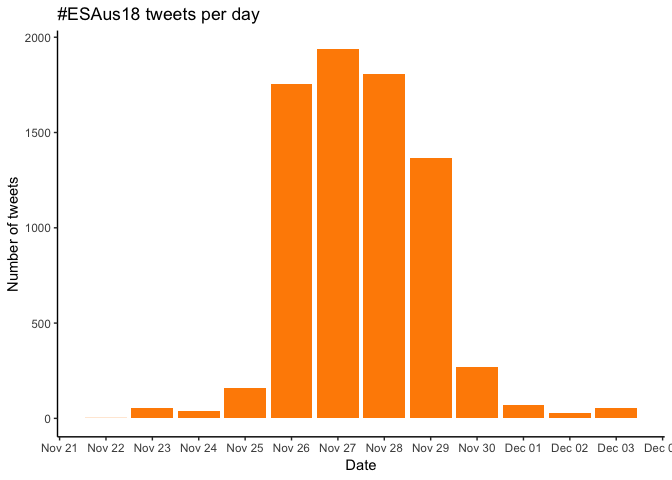

Tweets by day and time
----------------------

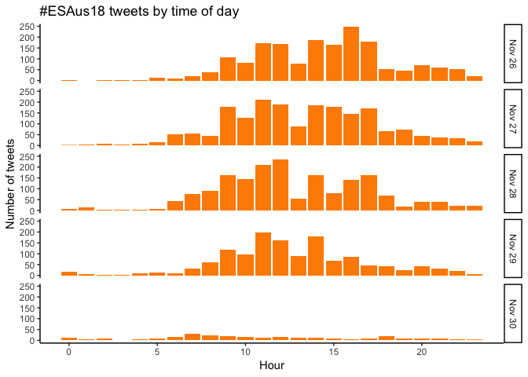

Users
=====

Top tweeters
------------

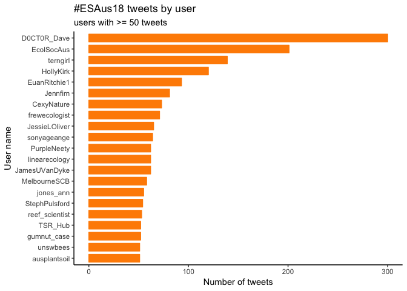

Sources
-------

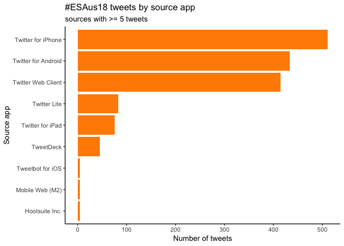

Networks
========

Replies
-------

The "replies network", composed from users who reply directly to one another.

Better to view the original PNG file in the `data` directory.

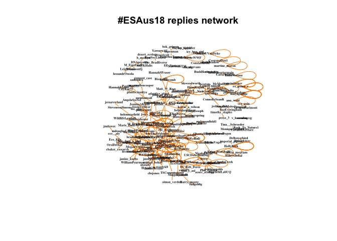

User networks per day
---------------------

You can see more appealing networks [here](https://twitter.com/AarontheEcolog/status/1067556027871092737/photo/1). These were done by [Aaron Greenville](https://twitter.com/AarontheEcolog)

Retweets
========

Retweet proportion
------------------

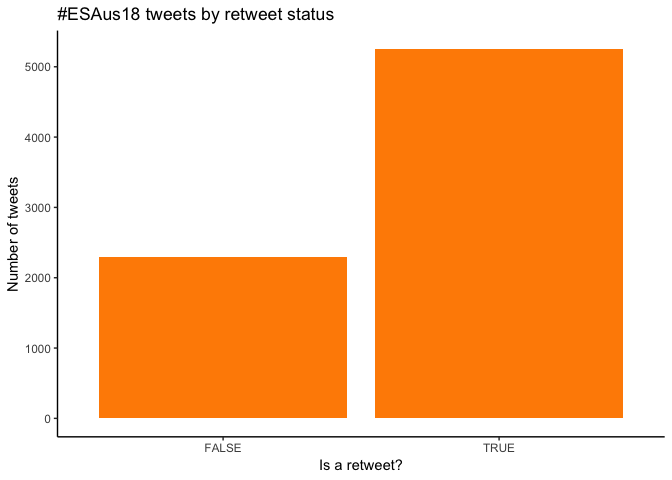

Retweet count
-------------

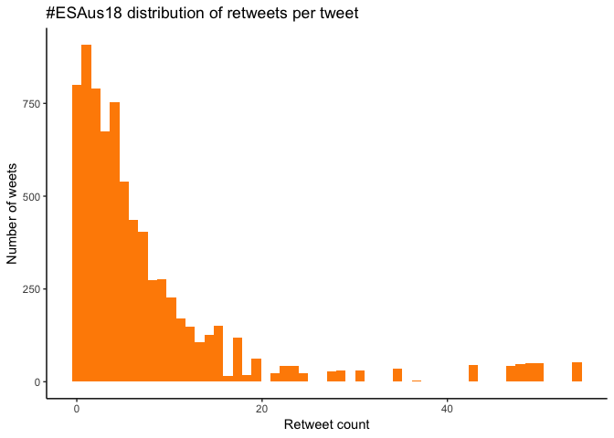

Top retweets
------------

<table style="width:92%;">
<colgroup>
<col width="25%" />
<col width="45%" />
<col width="20%" />
</colgroup>
<thead>
<tr class="header">
<th align="left">screen_name</th>
<th align="left">text</th>
<th align="right">retweet_count</th>
</tr>
</thead>
<tbody>
<tr class="odd">
<td align="left">RichardMcLellan</td>
<td align="left">If you haven’t read it yet, make sure you find time to read “The extraordinary life and death of the world’s oldest known spider” - easily one of the best pieces of science writing I’ve read for a long time. <a href="https://t.co/eGopsCdjp2" class="uri">https://t.co/eGopsCdjp2</a> Kudos @Mygal_Lady #WildOz 🕷 #SciComm #ESAus18 <a href="https://t.co/tYsmj534Bl" class="uri">https://t.co/tYsmj534Bl</a></td>
<td align="right">54</td>
</tr>
<tr class="even">
<td align="left">terngirl</td>
<td align="left">An amazing tour of the history of nature broadcasting in Australia by @jones_ann #ESAus18 where to next? Beyond the blokey adventure... <a href="https://t.co/rxnNrO1Gxo" class="uri">https://t.co/rxnNrO1Gxo</a></td>
<td align="right">50</td>
</tr>
<tr class="odd">
<td align="left">EcolSocAus</td>
<td align="left">This week 800 ecologists gathered in Brisbane for #ESAus18 the annual conference of the @EcolSocAus, addressing the theme ‘Ecology in the Anthropocene’. We've issued a statement calling for the following urgent actions:</td>
<td align="right">49</td>
</tr>
<tr class="even">
<td align="left">Susanna_Venn</td>
<td align="left">Calling potential PhD candidates: Love stomping around the mountains doing plant ecology? Come join the Extreme Plant Ecology Lab at @DeakinCIE Burwood, Melbourne. More details here: <a href="https://t.co/su8iqhXvY3" class="uri">https://t.co/su8iqhXvY3</a> #ESAus18 #nzes18 <a href="https://t.co/T1zbMQRnag" class="uri">https://t.co/T1zbMQRnag</a></td>
<td align="right">48</td>
</tr>
<tr class="odd">
<td align="left">ElisaBayra</td>
<td align="left">Going ‘extinct by neglect’: the state of Australia’s threatened birds <a href="https://t.co/nT8FhMVMQo" class="uri">https://t.co/nT8FhMVMQo</a> via @ausgeo @TSR_Hub @HugePossum @ayeshatulloch @BirdlifeOz #ESAus18</td>
<td align="right">47</td>
</tr>
<tr class="even">
<td align="left">HannahSFraser</td>
<td align="left">#ESAus18 @fidlerfm @TimParker88 and I are recruiting ecologists to independently analyse data. Will evaluate differences in approaches and results and consider how this type of replication study influences the validity and robustness of results. Let me know if you're interested <a href="https://t.co/eMgoUgwtXb" class="uri">https://t.co/eMgoUgwtXb</a></td>
<td align="right">43</td>
</tr>
<tr class="odd">
<td align="left">EcolSocAus</td>
<td align="left">There is no statistically significant evidence that killing #sharks makes people safer. And reliably achieving increased human safety would essentially require the eradication of sharks from large areas. So, here are some things we can do... @EuanRitchie1 #ESAus18 <a href="https://t.co/GhrrSdLoMS" class="uri">https://t.co/GhrrSdLoMS</a></td>
<td align="right">35</td>
</tr>
<tr class="even">
<td align="left">EcolSocAus</td>
<td align="left">Australian threatened bird populations drop by half in 30 years on average. New Threatened Species Index will draw attention to the state of our threatened birds &amp; which groups and regions are doing better or worse. <a href="https://t.co/PMsDLjaO2u" class="uri">https://t.co/PMsDLjaO2u</a> #TSX #ESAus18 @TSR_Hub @BirdlifeOz <a href="https://t.co/2XfNHGFs1X" class="uri">https://t.co/2XfNHGFs1X</a></td>
<td align="right">31</td>
</tr>
<tr class="odd">
<td align="left">FSchwarzmueller</td>
<td align="left">#ESAus18 is entirely vegetarian and gives out wooden cutlery in the conference bag. That shows the commitment to forging a sustainable future. Well done @EcolSocAus and thanks @WileyGlobal <a href="https://t.co/C47HSY6bXz" class="uri">https://t.co/C47HSY6bXz</a></td>
<td align="right">29</td>
</tr>
<tr class="even">
<td align="left">HollyKirk</td>
<td align="left">#ESAus18 @BiodiversityGuy explores the ecological function of people. Place based societies are/were integral to ecosystem function in many landscapes. &quot;When we lose people, we lose ecological function&quot; People are predators, generalists &amp; could be considered keystone species. <a href="https://t.co/RvHUYTv1tk" class="uri">https://t.co/RvHUYTv1tk</a></td>
<td align="right">28</td>
</tr>
</tbody>
</table>

Favourites
==========

Favourite proportion
--------------------

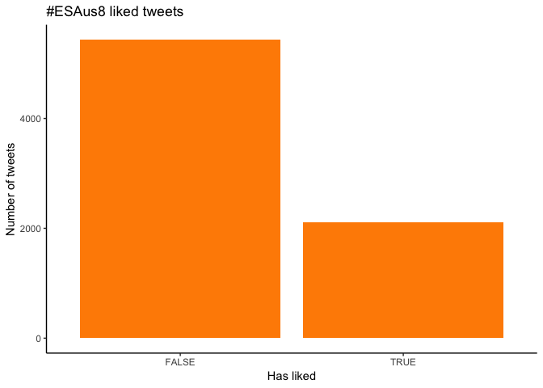

Favourite count
---------------

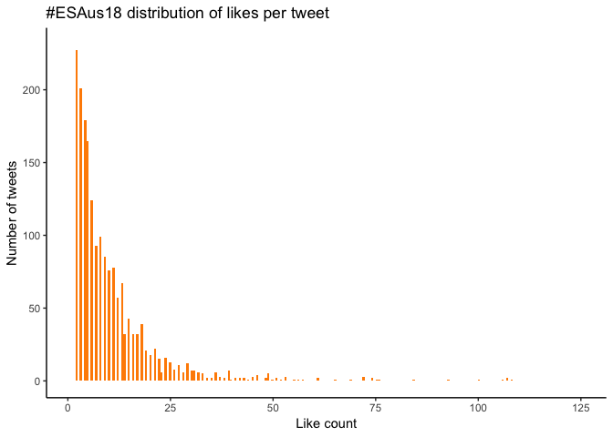

Top favourites
--------------

<table style="width:93%;">
<colgroup>
<col width="25%" />
<col width="45%" />
<col width="22%" />
</colgroup>
<thead>
<tr class="header">
<th align="left">screen_name</th>
<th align="left">text</th>
<th align="right">favorite_count</th>
</tr>
</thead>
<tbody>
<tr class="odd">
<td align="left">FSchwarzmueller</td>
<td align="left">#ESAus18 is entirely vegetarian and gives out wooden cutlery in the conference bag. That shows the commitment to forging a sustainable future. Well done @EcolSocAus and thanks @WileyGlobal <a href="https://t.co/C47HSY6bXz" class="uri">https://t.co/C47HSY6bXz</a></td>
<td align="right">235</td>
</tr>
<tr class="even">
<td align="left">HannahSFraser</td>
<td align="left">You know you're at an ecology conference when 30 people are willing to meet at 5am to go birding #ESAus18 <a href="https://t.co/BGvcPiZ6wf" class="uri">https://t.co/BGvcPiZ6wf</a></td>
<td align="right">108</td>
</tr>
<tr class="odd">
<td align="left">floraskates</td>
<td align="left">I had so much fun creating my #ESAus18 poster &amp; even more fun chatting about #carnivorousplants &amp; #scicomm with everyone! I was honoured to receive the Australian Flora Foundation poster prize 😊 Thanks @EcolSocAus for a great conference! <a href="https://t.co/qM9NmDcv16" class="uri">https://t.co/qM9NmDcv16</a></td>
<td align="right">107</td>
</tr>
<tr class="even">
<td align="left">pelentini</td>
<td align="left">Shout-out to all the very encouraging nodders in the audience at #ESAus18, and the important support they provide to nervous student speakers. Special mention to @JaneElith who is nodding for @bEcologist right now, but you all know who you are 🙌 <a href="https://t.co/0NyvqPdf4E" class="uri">https://t.co/0NyvqPdf4E</a></td>
<td align="right">107</td>
</tr>
<tr class="odd">
<td align="left">CSIROPublishing</td>
<td align="left">Congratulations to Chris Dickman, co-author of Secret Lives of Carnivorous Marsupials and many other titles, who received the @EcolSocAus Gold Medal for his substantial contribution to the study of ecology in Australia at #ESAus18 yesterday! <a href="https://t.co/x4pSZfvVwA" class="uri">https://t.co/x4pSZfvVwA</a></td>
<td align="right">106</td>
</tr>
<tr class="even">
<td align="left">RichardMcLellan</td>
<td align="left">If you haven’t read it yet, make sure you find time to read “The extraordinary life and death of the world’s oldest known spider” - easily one of the best pieces of science writing I’ve read for a long time. <a href="https://t.co/eGopsCdjp2" class="uri">https://t.co/eGopsCdjp2</a> Kudos @Mygal_Lady #WildOz 🕷 #SciComm #ESAus18 <a href="https://t.co/tYsmj534Bl" class="uri">https://t.co/tYsmj534Bl</a></td>
<td align="right">100</td>
</tr>
<tr class="odd">
<td align="left">terngirl</td>
<td align="left">An amazing tour of the history of nature broadcasting in Australia by @jones_ann #ESAus18 where to next? Beyond the blokey adventure... <a href="https://t.co/rxnNrO1Gxo" class="uri">https://t.co/rxnNrO1Gxo</a></td>
<td align="right">93</td>
</tr>
<tr class="even">
<td align="left">HeardGW</td>
<td align="left">Last night, on route to #ESAus18, I witnessed Australian fireflies for the first time. Their emergence on dark transformed the rainforest gully in which we were camped. It is one of the best things I've ever seen.</td>
<td align="right">84</td>
</tr>
<tr class="odd">
<td align="left">dieterhochuli</td>
<td align="left">The 5am start for the #ESAus18 Oxley Common birding walk was a bit early for me, but it turns out there are some spectacular urban birding opportunities in Fortitude Valley. #tick <a href="https://t.co/xrtRC8AF8T" class="uri">https://t.co/xrtRC8AF8T</a></td>
<td align="right">76</td>
</tr>
<tr class="even">
<td align="left">Erica_Marshall1</td>
<td align="left">If you want to know about biodiversity offsetting and the impacts of biodiversity metric choice on #threatenedspecies please come see my poster and have a chat with me at #ESAus18......also look out for the #ecologicalfashion I will be sporting some iconic species <a href="https://t.co/x3jRjzH3pf" class="uri">https://t.co/x3jRjzH3pf</a></td>
<td align="right">75</td>
</tr>
</tbody>
</table>

Quotes
======

Quote proportion
----------------

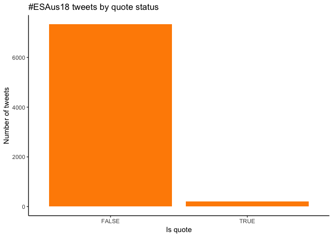

Quote count
-----------

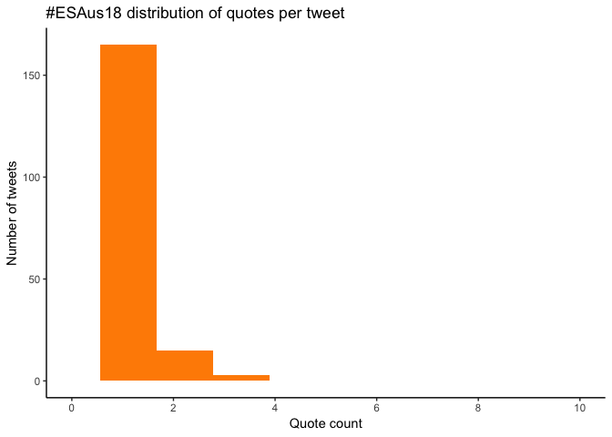

Top quotes
----------

<table style="width:89%;">
<colgroup>
<col width="25%" />
<col width="45%" />
<col width="18%" />
</colgroup>
<thead>
<tr class="header">
<th align="left">screen_name</th>
<th align="left">text</th>
<th align="right">quote_count</th>
</tr>
</thead>
<tbody>
<tr class="odd">
<td align="left">JessicaMillerAU</td>
<td align="left">Well this is a welcome surprise! Next conference looking forward to a plant based diet, zero waste and local producers as standard :) #ethicaleating #environment #fairfood #eatlocal #sustainability #walkthetalk #waronwasteau #ESAus18 <a href="https://t.co/PdjHtVq92Z" class="uri">https://t.co/PdjHtVq92Z</a></td>
<td align="right">3</td>
</tr>
<tr class="even">
<td align="left">HumphreyJE_</td>
<td align="left">What a brilliant idea! Well done @EcolSocAus !! #ESAus18 <a href="https://t.co/Wc6V9X3GD6" class="uri">https://t.co/Wc6V9X3GD6</a></td>
<td align="right">3</td>
</tr>
<tr class="odd">
<td align="left">diagnosedieback</td>
<td align="left">Lots of firsts at #ESAus18. Only veg food, parental subsidies provided, more female than male plenaries, lots of speed talks, and this awesome set of wooden cutlery 🍴great job @EcolSocAus organising committee! <a href="https://t.co/BcaiNbV6j6" class="uri">https://t.co/BcaiNbV6j6</a></td>
<td align="right">3</td>
</tr>
<tr class="even">
<td align="left">EcolSocAus</td>
<td align="left">On now... and you can listen in anywhere in Australia via the ABC listen app! Ecology on the radio. #ecology #climatechange #biodiversity #urbanecology #ESAus18 <a href="https://t.co/YyV9bSZbEU" class="uri">https://t.co/YyV9bSZbEU</a></td>
<td align="right">3</td>
</tr>
<tr class="odd">
<td align="left">EcolSocAus</td>
<td align="left">If you missed this crew talking about #ecology in the #Anthropocene on @abcbrisbane yesterday the podcast is now up <a href="https://t.co/LEgCut573J" class="uri">https://t.co/LEgCut573J</a> (They even took talkback questions!) #ecology #climatechange #biodiversity #urbanecology #ESAus18 <a href="https://t.co/YyV9bSZbEU" class="uri">https://t.co/YyV9bSZbEU</a></td>
<td align="right">3</td>
</tr>
<tr class="even">
<td align="left">GU_Sciences</td>
<td align="left">Hear from Catherine Pickering &amp; @ChantalHuijbers from @Griffith_ENV as they chat about 'Ecology in the Anthropocene' on @abcbrisbane #ESAus18 <a href="https://t.co/LmzKqX7uv2" class="uri">https://t.co/LmzKqX7uv2</a> <a href="https://t.co/oCCld2O7bh" class="uri">https://t.co/oCCld2O7bh</a></td>
<td align="right">3</td>
</tr>
<tr class="odd">
<td align="left">eco__aly</td>
<td align="left">Combining all 4 days of the questions at #ESAus18 (that i saw): we dominated overall with 34 of 57 Qs from women (60%). #WomenInSTEM <a href="https://t.co/m4FYtUHDzL" class="uri">https://t.co/m4FYtUHDzL</a></td>
<td align="right">3</td>
</tr>
<tr class="even">
<td align="left">ecologistmills</td>
<td align="left">Cool thread - nice work @eco__aly and well done organisers of #ESAus18 for the diversity and equity! <a href="https://t.co/4yxyt2k1qh" class="uri">https://t.co/4yxyt2k1qh</a></td>
<td align="right">3</td>
</tr>
<tr class="odd">
<td align="left">astro_katross</td>
<td align="left">This is a really cool and important thread! For anyone going to conferences I urge you to take similar data. I'm so glad to see such an improvement! Go #ESAus18 <a href="https://t.co/5TRkWV7XO1" class="uri">https://t.co/5TRkWV7XO1</a></td>
<td align="right">3</td>
</tr>
<tr class="even">
<td align="left">BloodyK8</td>
<td align="left">I enjoy this time of the year because this event is on &amp; I get to follow #ecologicalfashion oh, &amp; catch-up on #ecology too! #ESAus18 - it’s on now! <a href="https://t.co/jvPYSkdaWj" class="uri">https://t.co/jvPYSkdaWj</a></td>
<td align="right">2</td>
</tr>
</tbody>
</table>

Media
=====

Media count
-----------

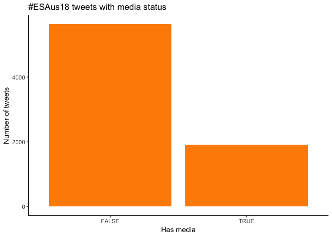

Top media
---------

<table style="width:93%;">
<colgroup>
<col width="25%" />
<col width="45%" />
<col width="22%" />
</colgroup>
<thead>
<tr class="header">
<th align="left">screen_name</th>
<th align="left">text</th>
<th align="right">favorite_count</th>
</tr>
</thead>
<tbody>
<tr class="odd">
<td align="left">FSchwarzmueller</td>
<td align="left">#ESAus18 is entirely vegetarian and gives out wooden cutlery in the conference bag. That shows the commitment to forging a sustainable future. Well done @EcolSocAus and thanks @WileyGlobal <a href="https://t.co/C47HSY6bXz" class="uri">https://t.co/C47HSY6bXz</a></td>
<td align="right">235</td>
</tr>
<tr class="even">
<td align="left">HannahSFraser</td>
<td align="left">You know you're at an ecology conference when 30 people are willing to meet at 5am to go birding #ESAus18 <a href="https://t.co/BGvcPiZ6wf" class="uri">https://t.co/BGvcPiZ6wf</a></td>
<td align="right">108</td>
</tr>
<tr class="odd">
<td align="left">floraskates</td>
<td align="left">I had so much fun creating my #ESAus18 poster &amp; even more fun chatting about #carnivorousplants &amp; #scicomm with everyone! I was honoured to receive the Australian Flora Foundation poster prize 😊 Thanks @EcolSocAus for a great conference! <a href="https://t.co/qM9NmDcv16" class="uri">https://t.co/qM9NmDcv16</a></td>
<td align="right">107</td>
</tr>
<tr class="even">
<td align="left">pelentini</td>
<td align="left">Shout-out to all the very encouraging nodders in the audience at #ESAus18, and the important support they provide to nervous student speakers. Special mention to @JaneElith who is nodding for @bEcologist right now, but you all know who you are 🙌 <a href="https://t.co/0NyvqPdf4E" class="uri">https://t.co/0NyvqPdf4E</a></td>
<td align="right">107</td>
</tr>
<tr class="odd">
<td align="left">CSIROPublishing</td>
<td align="left">Congratulations to Chris Dickman, co-author of Secret Lives of Carnivorous Marsupials and many other titles, who received the @EcolSocAus Gold Medal for his substantial contribution to the study of ecology in Australia at #ESAus18 yesterday! <a href="https://t.co/x4pSZfvVwA" class="uri">https://t.co/x4pSZfvVwA</a></td>
<td align="right">106</td>
</tr>
<tr class="even">
<td align="left">RichardMcLellan</td>
<td align="left">If you haven’t read it yet, make sure you find time to read “The extraordinary life and death of the world’s oldest known spider” - easily one of the best pieces of science writing I’ve read for a long time. <a href="https://t.co/eGopsCdjp2" class="uri">https://t.co/eGopsCdjp2</a> Kudos @Mygal_Lady #WildOz 🕷 #SciComm #ESAus18 <a href="https://t.co/tYsmj534Bl" class="uri">https://t.co/tYsmj534Bl</a></td>
<td align="right">100</td>
</tr>
<tr class="odd">
<td align="left">terngirl</td>
<td align="left">An amazing tour of the history of nature broadcasting in Australia by @jones_ann #ESAus18 where to next? Beyond the blokey adventure... <a href="https://t.co/rxnNrO1Gxo" class="uri">https://t.co/rxnNrO1Gxo</a></td>
<td align="right">93</td>
</tr>
<tr class="even">
<td align="left">dieterhochuli</td>
<td align="left">The 5am start for the #ESAus18 Oxley Common birding walk was a bit early for me, but it turns out there are some spectacular urban birding opportunities in Fortitude Valley. #tick <a href="https://t.co/xrtRC8AF8T" class="uri">https://t.co/xrtRC8AF8T</a></td>
<td align="right">76</td>
</tr>
<tr class="odd">
<td align="left">Erica_Marshall1</td>
<td align="left">If you want to know about biodiversity offsetting and the impacts of biodiversity metric choice on #threatenedspecies please come see my poster and have a chat with me at #ESAus18......also look out for the #ecologicalfashion I will be sporting some iconic species <a href="https://t.co/x3jRjzH3pf" class="uri">https://t.co/x3jRjzH3pf</a></td>
<td align="right">75</td>
</tr>
<tr class="even">
<td align="left">sonyageange</td>
<td align="left">Feeling very privileged to receive the @EcolSocAus Flora Foundation Prize for a talk at #ESAus18. It's been an amazing conference, and look forward to many more! Thanks to all the colleagues and friends at @EcoEvo_ANU too 🙂 <a href="https://t.co/yXuX9RMXEg" class="uri">https://t.co/yXuX9RMXEg</a></td>
<td align="right">72</td>
</tr>
</tbody>
</table>

### Most liked media image

Tweet text
==========

Top words used 30 or more times.

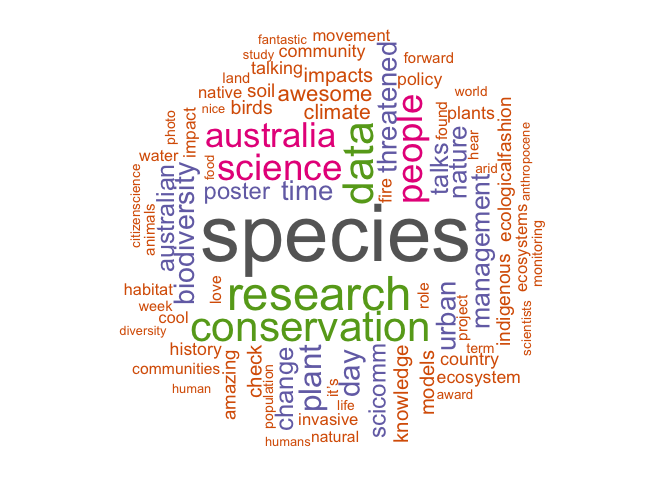
